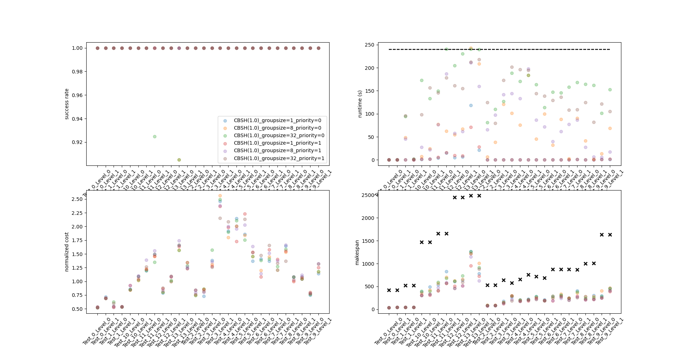

# Dependency

1. Downgrade your python to 3.6 and make sure python-dev is also installed.

2. Install boost 1.61.0 (must include libboost-python3)
    * Follow Section 5 in [boost 1.61.0 document](https://www.boost.org/doc/libs/1_61_0/more/getting_started/unix-variants.html) to install the library;
    * In particular, when you run bootstrap.sh, make sure it finds the correct version of python. If you didn't see "Detecting Python version... 3.6", use bootstrap.sh --help to learn to configure path to your python manually.
    * After installation, make sure that libboost-python3 is in you boost library (which is located at /usr/local/lib by defalult). You might find the library with a slightly different name (e.g., libboost-python36 or libboost-python-py36), in which case, you need to replace "python3" with the last part of the name of your library for variable boostPython in both PythonCBS\CMakelists.txt and CBSH-rect-cmake\CMakeLists.txt. For example, change "set(boostPython python3)" to "set(boostPython python36)".
3. If you are using windows, configure paths of dependencies manually.

# Usage

Compile codes and make sure libPythonCBS.xx is compiled at the folder where your python codes are.

Then, in python codes:

```python
from libPythonCBS import PythonCBS
f_w = 1
debug = True
timelimit = 240  # unit: seconds
default_group_size = 16 # max number of agents in a group
corridor_method = 1 # or 0/off or 2/reasonable corridor. Suggest 1
chasing = True # helps when speed =1, however takes more time on corridor reasoning.
accept_partial_solution = True
agent_priority_strategy = 0  #  the strategy for sorting agents, choosing a number between 0 and 5
#                               0: keep the original ordering
#                               1: prefer max speed then max distance
#                               2: prefer min speed then max distance
#                               3: prefer max speed then min distance
#                               4: prefer min speed then min distance
#                               5: prefer different start locations then max speed then max distance
CBS = PythonCBS(env, "CBSH", timelimit, default_group_size, debug, f_w,
                corridor_method, chasing, accept_partial_solution, agent_priority_strategy)
success = CBS.search()
plan = CBS.getResult()
```

corridor_method can be "trainCorridor1" or "corridor2" or "". 
"trainCorridor1" is more greedy which don't consider bypass paths of a corridor.
"corridor2" considerd bypass paths.
"" turn off corridor reasoning.

If accept_partial_solution is True, when when timeout, we obtain a maximal subset of collision-free paths from one of the CBS nodes.

Success is a boolean, which indicate does the search success.

plan is a list of list, which stores paths of all agents. 

The format of a path is \[-1, -1,200,234,345\]. -1 indicate the train is not active.
If a path is an empty list \[\], 
it is either we cannot find a path for the train to reach its goal location before the deadline 
or we do not have time to plan its path. 
    
run_test2.2.py contains a test example.

run_batch.py is a script to test algorithms on the official provided test cases. 
data_analysis/data_analysis.py analyzes the results (success rate, solution cost, etc.) got from run_batch.py.

Currently, this cbs handles both speed = 1 or agents have different speed. However, when agents have different speed, 
the performance will drop down dramatically without corridor reasoning. Corridor reasoning contains a method that reasoning
chasing conflicts between agents with different speed. But this method may contain bugs and pending testing at this stage.

The suboptimal parameter f_w is available. But may have problems when f_w != 1 and working with corridor reasoning, at this stage.


# Algorithm Overview

## MAPF Model
Here is a summary of the changes to the standard MAPF model:
* Agents do not appear on the map before they start to move and disappear from the map after reaching their goal locations.
* Each agent is given a constant speed (but the traversal time of an edge is still an integer).
* The orientations of the agents are considered. In most cases (unless hitting a deadend), the agents cannot move backwards.
* Agents can only move to empty cells. That is, this is a k-robust MAPF with k=1.
* Agents need to reach their goal locations before a given max timestep. Accoriding to their [document](http://flatland-rl-docs.s3-website.eu-central-1.amazonaws.com/04_specifications.html#maximum-number-of-allowed-time-steps-in-an-episode), max_timestep = timedelay_factor * alpha * (env.width + env.height + ratio_nr_agents_to_nr_cities), where the following default values are used: timedelay_factor=4, alpha=2 and ratio_nr_agents_to_nr_cities=20.

For now, we do not consider the malfunction in this model.

## Framework
We use a hybrid framework of prioritized planning and CBS. Here is the pseudo-code:

```c++
A = [a1, a2, ...];  // unplanned agents
P = {};  // planned paths
A = sort(A);  // sort the agents by some heuristics (e.g., speed, distance to the goal location)
m = M; // M is the default number of agents in a group
while(A is not empty) {
    a = first m agents in A;
    T = remaining_runtime * m / 2|A|;
    paths = CBS(a, T, P);  // try to find collision-free paths for agents in a that do not collide with any path in P by CBS with a time limit of T 
    if(paths are found) {
        m = min(2 * m, M);
    } else {
        m = m / 2;
        N = the first node in the focal list of CBS;
        paths = a maximal subset of collision-free paths in N.paths;
        a = the corresponding agents;
    }
    add paths to P;
    Remove a from A;
}
```

In particular, if M is the number of total agents, our framework is identical to CBS. If M is 1, our framework is identical to prioritized planning.

## CBS
For the CBS solver, we have the following major changes:
* We use k-robust CBSH with k = 1.
* We use CBS-DL from [MAPF with deadlines](http://idm-lab.org/bib/abstracts/papers/ijcai18b.pdf), which changes the objective of CBS to the minimization of
    1. the number of dead agents, i.e., agents that fail to reach their goal locations before the deadline; then
    2. the overall makespan so far (including the planned paths in previous iterations); and last
    3. the sum of costs.
* We use symmetry reasoning technique for:
    * corridor conflicts,
    * chasing conflicts, and
    * start conflicts (to be done).
* We use focal search at the high-level of CBS. CBS node n is in the focal list iff
    * n.num_of_dead_agents == best.num_of_dead_agents,
    * n.makespan <= max(best.makespan, makespan(P), max_timestep / 2), and
    * n.sum_of_costs + n.h <= w * (best.sum_of_costs + best.h),
   
   where best is the first node in the open list, makespan(P) is the makespan of the planned paths, and w is the user-provided suboptimality bound.


# Performance Summary

We test version ``test#1`` on the given benchmark [test-neurips2020-round1-v1](https://www.aicrowd.com/challenges/neurips-2020-flatland-challenge/dataset_files). 

The input perimeters are:
```python
f_w = 1
debug = False
k = 1
timelimit = 240
default_group_size = 1  # or 8 or 32
corridor_method = 1
chasing = True
accept_partial_solution = True
agent_priority_strategy = 0  # or 1 or 3
```



[Top left] Success rate is the percentage of agents that reach their goal locations before the max timestep.

[Top right] The horizontal dashed line is the runtime limit (= 4 minutes).

[Bottom left] Normalized cost is the sum of costs divided by the number of agents that reach their goal locations 
and then divided by the sum of the width and height of the map.

[Bottom right] The black X marks are the max timesteps.

Here is a summary:

| Priority | Group size | Success rate | Runtime (s) | Normalized cost | Makespan |
|:---:|---:|---:|---:|---:|---:|
| original (0)     |  1 | 1.000 |   6.39 | 1.216 | 349.00 |
| original (0)     |  8 | 0.997 |  64.42 | 1.198 | 349.78 |
| original (0)     | 32 | 0.994 | 144.51 | 1.216 | 345.96 |
| max distance (1) |  1 | 1.000 |   5.31 | 1.226 | 281.79 |
| max distance (1) |  8 | 1.000 |  75.33 | 1.254 | 280.75 |
| max distance (1) | 32 | 1.000 | 128.27 | 1.243 | 297.82 |


# Past Winner Solutions

Here are some material about the winner solutions of last year.


| Team | Initial planning | Replanning | Success rate in the final round |
| --- | --- | --- | --- |
|First place| Prioritized planning (max-speed agent first, breaking ties randomly) with multiple runs | MCP + prioritized planning   | 99% |
|[Second place](https://docs.google.com/presentation/d/12bbp7MwoB0S7FaTYI4QOAKMoijf_f4em64VkoUtdwts/edit#slide=id.g6dde6a5360_0_1)| Prioritized planning  (max-speed agent first, breaking ties by preferring min-distance agent) | MCP | 96% |
|[Third place](https://github.com/vetand/FlatlandChallenge2019/blob/master/Approach_description.pdf)| Prioritized planning  (max-speed agent first) | Replan the delayed agent by viewing it as the lowest-priority agent | 95% |
|[Fourth place](https://eprints.hsr.ch/855/1/Masterarbeit_Waelter_Jonas.pdf)| Prioritized planning (max-distance agent first) | Complete Path Reservation (CPR) or reinforcement learning| 79% |
|Fifth place| Reinforcement learning | Reinforcement learning | 55% |

There are also some [presentations](https://www.youtube.com/watch?v=rGzXsOC7qXg) available online.