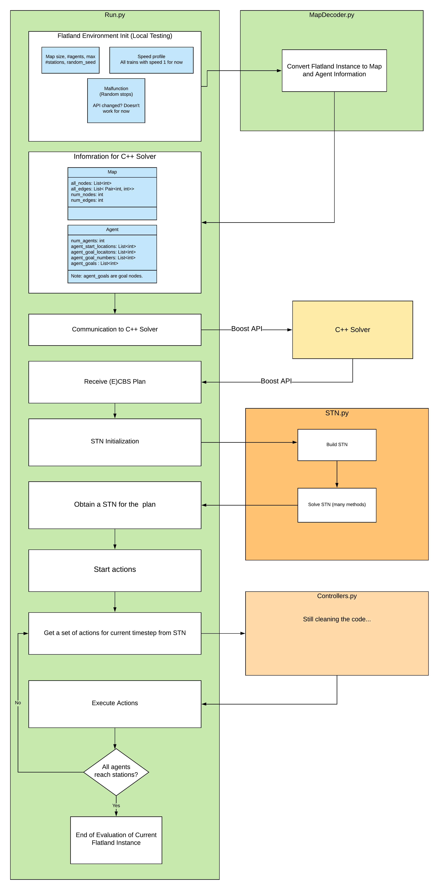

# Flatland 2

---
## How to install the CBS solver

The CBS solver is in the CBS-corridor folder. Go to the folder and follow the instruction there to compile the code. 
Make sure the generated libPythonCBS.xx is compiled at the folder where your python codes are.

---
## How to run evaluation

1. Go to Flatland2020 folder. 
2. Make sure that CBS solver is correctly compiled and libPythonCBS.xx is copied into the Flatland2020 Folder
3. conda activate flatland-rl
4. python run.py
5. hit enter to go to next time step

---

## Known Flatland Library Bugs/Issues

1. Local test environment does not work if the evaluation process was interrupted.

Reason: redis-server recorded something about the evaluation data in the server cache. If the evalution was interrupted, the cache remains and causes issues when the user tries to rerun the evalution. 

Solution:**redis-cli flushall** to empty cache and rerun the evaluation. Then it works.

2. Old Flatland Stochastic Data API does not work. Seems that they have changed the API. (Fixed)

New flatland API changes: 

```python
malfunction_generator_and_process_data=malfunction_from_params(malfunction_rate=malfunction_rate, min_duration=min_duration, max_duration= max_duration)
```

---

## Useful links: 

  ### - The challenge website: 
  https://flatland.aicrowd.com/intro.html 

  ### - Flatland Library Page (2.1.10, latest lib is 2.2.x):
   http://flatland-rl-docs.s3-website.eu-central-1.amazonaws.com/index.html 

  ### - Useful Discussions:

---

**Timeline:** 

- **June 1st - July 7th:** Warm-Up Round
- **July 7st - July 31st:** Round 1
- **August 1st - October 19th:** Round 2
- **October 20th - October 25th:** Post Challenge Analysis
- **October 25th:** Final Results Announced
- **October 16th - November 10th:** Post Challenge Wrap-Up

----

## Current Solution Structure

https://app.lucidchart.com/invitations/accept/156887d6-7e9f-43ca-af22-f24000d166d1




